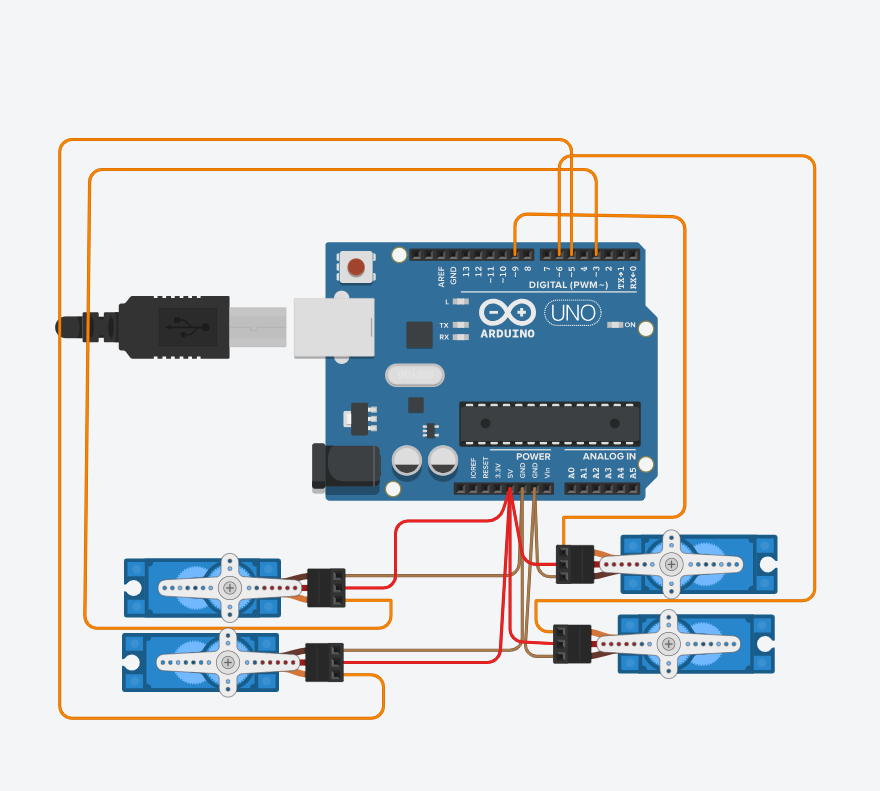

# 4-Servo Motor Control using Arduino (Tinkercad Simulation)

## Project Overview
This project simulates a humanoid robot using **4 servo motors** connected to an Arduino board in **Tinkercad**.  
The motors:
- Perform a **Sweep motion** (from 0° to 180° and back) for **2 seconds**.
- After that, all motors **stop and hold** at a fixed **90-degree angle**.

The goal is to demonstrate basic servo motor control and simulate part of a walking motion in a humanoid robot.

---

##  Components Used
- Arduino Uno
- 4x Servo Motors
- Jumper Wires
- Tinkercad (for simulation)

---

## How the Code Works
- The code initializes 4 servo motors connected to pins 3, 5, 6, and 9.
- Using `millis()`, it runs a sweep motion for exactly 2 seconds.
- After 2 seconds, all motors move to and hold at 90°, simulating a neutral or standing position.

---

## Walking Algorithm

The following algorithm outlines a basic walking behavior for a humanoid robot using servo motors:

1. Start the robot in a standing position (all servos at 90 degrees).  
2. Move the **left leg servo** forward to simulate a step.  
3. Shift the robot's **weight to the left leg**.  
4. Move the **right leg servo** forward.  
5. Shift the weight to the **right leg**.  
6. Repeat steps 2–5 to create a walking loop.  
7. When stopping, return all servos to the **90-degree standing position**.

---

## Circuit Diagram

Below is the circuit diagram as simulated in Tinkercad showing the servo motor connections to the Arduino:

---

## Project Files

| File | Description |
|------|-------------|
| `README.md` | This file, explaining the full project |
| `circuit.png` | Image of the circuit layout from Tinkercad |
| `4Servo-Sweep.brd` | PCB board design for the hardware circuit |

---

## Notes
- The `.brd` file can be opened in PCB design software like Autodesk Eagle or similar.
- This project is part of a robotics simulation exercise using Arduino and Tinkercad.

